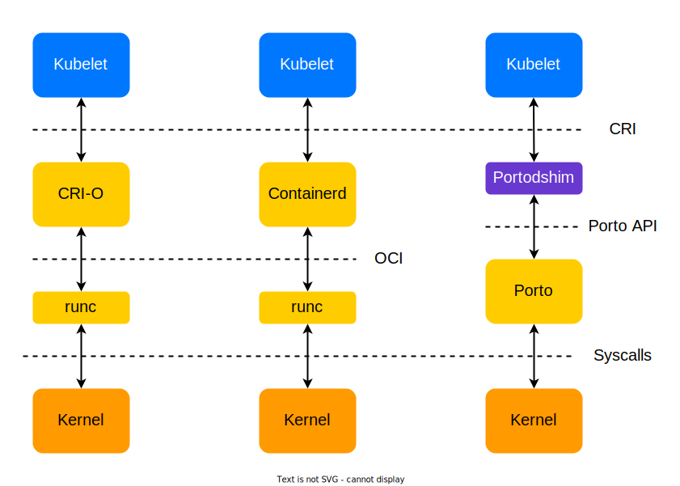

# Portodshim

Portodshim is a CRI ([Container Runtime Interface](https://kubernetes.io/docs/concepts/architecture/cri)) plugin 
for [Porto](https://github.com/yandex/porto) container management system.

Portodshim allows Porto daemon to communicate with kubelet, so Porto can be used as Kubernetes container runtime. 
Portodshim is written on Go programming language.




## Quick start

### Dependencies

Install [Porto container runtime](../README.md) and [Go programming language](https://go.dev/doc/install) (at least v1.17). 
Run Porto after installation.

### Build

Download Portodshim project from github.com:
```bash
git clone https://github.com/<portodshim repository>
cd portodshim
```

Build Porto and Portodshim using CMake:
```bash
go build -o portodshim .
```


### Run

Execute Portodshim binary file (in background optionaly):
```bash
sudo ./portodshim &
```
or
```bash
sudo ./portodshim --debug & # add debug logs
```

The following socket has to appear after all actions ```/run/portodshim.sock```.

You can use [crictl](https://github.com/kubernetes-sigs/cri-tools) to check portodshim is running:
```bash
crictl --runtime-endpoint="unix:///run/portodshim.sock" ps
crictl --image-endpoint="unix:///run/portodshim.sock" images
``` 

Also you can write the following config to ```/etc/crictl.yaml``` and do not specify endpoint flags:
```yaml
runtime-endpoint: unix:///run/portodshim.sock
image-endpoint: unix:///run/portodshim.sock
```


## Kubernetes over Porto

You should specify three kubelet flags to use Kubernetes with Porto:
```bash
--container-runtime="remote"
--container-runtime-endpoint="unix:///run/portodshim.sock"
--container-image-endpoint="unix:///run/portodshim.sock"
```

Kubelet uses Portodshim as a CRI service and sends CRI gRPC request to it. 
In turn Portodshim converts СRI request from kubelet to Porto request and forward it to Porto. 
Porto performs request. So Portodshim works as proxy between kubelet and Porto.
